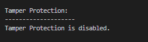

# SAMACHI: Secure Audit Machine

### By Anna Pratt, Riley Croft, Dallin Duke, and Eric Pressler

# BYU IS 565 - Digital Forensics with Dr. Justin Giboney

## Overview

SAMACHI (Secure-Audited Machine) is a simple PowerShell script that checks your Windows device for some basic secure configuration settings. We developed it as a custom security tool to help cyber defenders with checking Windows configurations for security concerns. We are currently developing this script and adding more features so that it checks for more configuration settings.

### How to Run

To run SAMACHI, first download the file or clone this GitHub repo. The easiest way to run the script is to right click the .ps1 file and choose the option "Run with PowerShell".

_Figure 1: Run with PowerShell option after right-clicking the file._

#### Potential Problems

Windows might not let you run this script by default because the script is of unknown origin.

If you see an Unknown Publisher error as shown in Figure 2 below, click on the Open button. Microsoft shows this warning to help prevent users from running malicious scripts. The script should run after you click "Open".

_Figure 2: Unknown Publisher Error_

Because this script is not signed, many people encounter an issue with the execution policy. We have observed that cachines running Windows 11 encounter this issue more often, but it may occur on Windows 10 as well. In order to avoid this issue perform the following steps:

1. Run powershell as Admin
2. Check your execution policy so that you can return it back to normal after running the script. Run `Get-ExecutionPolicy -List` and make note of the default settings.
3. Run `Set-ExecutionPolicy Unrestricted` to enable any script to be run. Then press r to run.

_Figure 3: Set-ExecutionPolicy Unrestricted Example_

4. Run the script.
5. Return the execution policy to how it was set before in order to keep your machine secure with `Set-ExecutionPolicy -ExecutionPolicy Restricted -Scope LocalMachine`.

_Figure 4: Set-ExecutionPolicy Restricted Example_

### Proof of Concept

_Figure 5: shows what it looks like when all of the user’s firewalls are enabled._

_Figure 6: shows what it looks like when the user’s domain firewall is disabled._

_Figure 7: shows what it looks like when the user’s domain and private firewalls are disabled._

_Figure 8: shows the script output when the Guest account is disbled, and when Windows updates are pending to be installed._

_Figure 9: shows the script output when the Guest account is enabled. Note that the script notices the Guest account is enabled and recommends it to be disabled._

_Figure 10: shows a visual representation of the updates that were detailed in the script. The script notified the user that they needed to install these updates._

_Figure 11: shows the output when tamper protection is not enabled_

_Figure 11: shows the output when tamper protection is enabled_

## Features

The automated program audits the following security features:

- Antivirus
- Firewall
- User Accounts
- Windows Updates
- Miscellaneous Security Features

  - Smart Screen
  - Secure Boot
  - SMBv1
  - Tamper Protection
